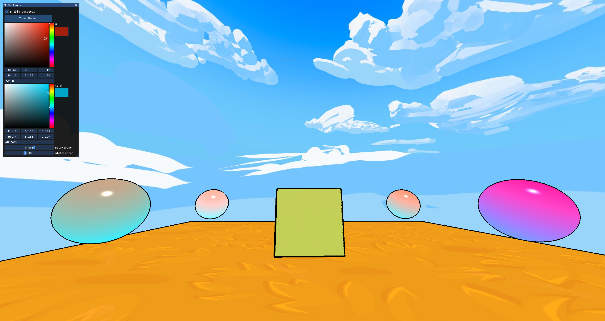
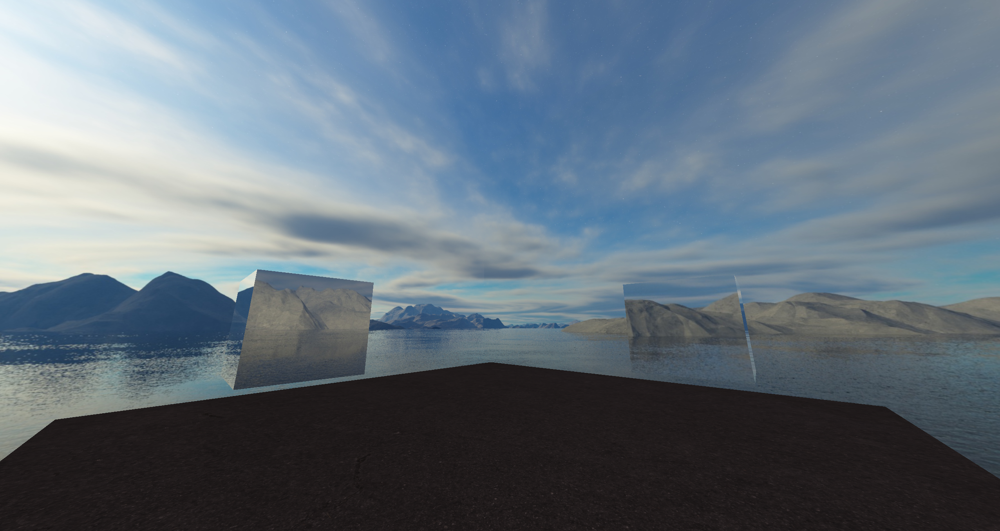
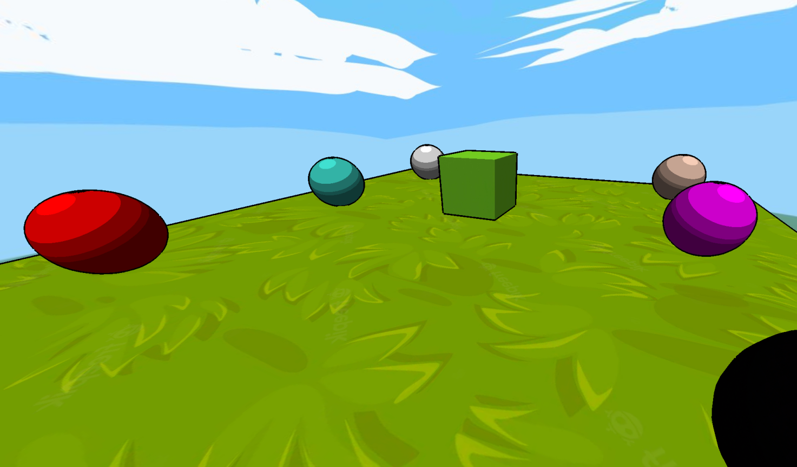
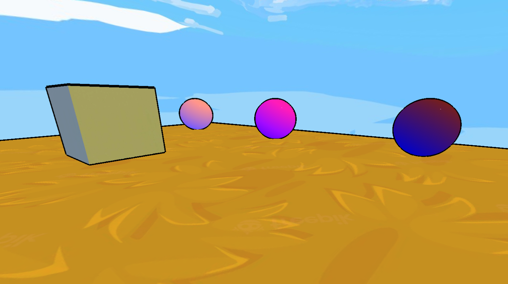

# Graphic Lighting Talks 

## Presentation 

 

## Introduction 
`Graphic Effects` is a project made for introducing us to different graphic effects with OpenGL.   
We chose to implement the NPR (Gooch/Toon) and a skybox effect to our world, all of this based on our past engine.   
This project has been made by **RABINNE Lenny** and **ERBISTI Matéo**, students at Isart Digital.   
It started on `January 2nd` and finished on `January 20th`.   

### Controls: 
The default controls are:   
-WASD to move around   
-Hold right mouse button to look around   

## Skybox Effect: 
The first graphic effect that we wanted to do was a great skybox, our old engine had a basic cube with inverted normals to render a 'skybox texture'.   
It was not it so we wanted to improve it. To do so, we used a cubemap supported by OpenGL.   
The goal of this technology is to save 6 2D textures into one and only, so one texture per face.   
After loading the skybox, we obviously need to draw it, it's the first drawn object of the scene.   
For the OpenGL part, we need to disable the `Depth writing` with glDepthMask to draw it,   
then reactivate it for the rest of the scene. This part is useful because the skybox will always be drawn behind everything else.   
Moreover, we did 2 material types: a refractor and a reflector. They both have their own shaders, so the skybox does.   
 

## NPR Effects: 
NPR stand's for Non-photorealistic rendering, basically the well-known way to render abstract or cartoony objects and characters.   
It often uses outlines but the goal wasn't to go in-deep into that technologies, we decided to do basic OpenGL ones.   
We first did render all object's outlines in the back with a black texture,   
then we rendered them 'normally', with their original texture on the front.   

----------- 
### Toon Shader: 
After the skybox, we moved to some shading effects, the first one was the toon/cel shading.   
Basically we implemented a new shader that has his lights divided into (in our case) 5 different parts.   
For example, the smaller the angle between the light direction and the normal is, the bigger the light's intensity will be.   
Once we've calculated the dot product of the light direction and the pixel's normal we can define how bright will be the pixel.   
After that we multiply the pixel's texture color and its given light color to obtain the final rendering.   

 

----------- 
### Gooch Shader: 
We finally did the Gooch shading which is more of an abstract shading.   
It uses the principle of cold and warm colors, like the more it's exposed to light, the warmer it is.   
To calculate the final color, we have to add the pixel's texture color and color calculated by the gooch shader.   
We also have 2 tweakable values that are the degree of priority given to the cold or warm color over the pixel's texture color.   

